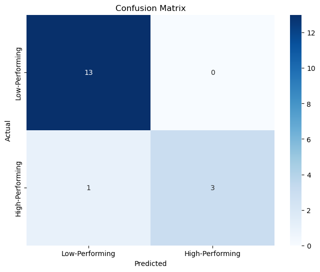
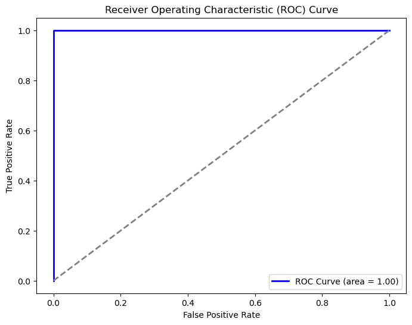

# School Performance Prediction Using Random Forest Classifier

## Overview
This repository contains a comprehensive data analytics project focused on predicting school performance based on various educational metrics. The project utilizes a Random Forest Classifier to classify schools as high-performing or low-performing, employing hyperparameter tuning and cross-validation techniques to build a robust model.

## Features
- **Data Cleaning and Preprocessing**: Handles missing values, removes duplicates, and converts percentage strings to numeric values.
- **Feature Engineering**: Identifies high-performing schools based on median scores for English, Math, and Graduation Rate.
- **Model Training and Hyperparameter Tuning**: Uses GridSearchCV for optimal hyperparameter selection and K-Fold cross-validation for reliable model evaluation.
- **Model Evaluation**: Provides accuracy, precision, recall, and F1-score metrics.
- **Visualization**: Includes confusion matrix and ROC curve visualizations for performance analysis.
- **Result Export**: Saves final predictions and performance labels to an Excel file.

## Outcome
The Random Forest Classifier achieved a high accuracy of 94.12% in predicting school performance. The cross-validated metrics demonstrated strong performance with robust precision and recall values. The visualizations, including the confusion matrix and ROC curve, provide a clear interpretation of the model's prediction capabilities.

### Visualizations
#### 1. Confusion Matrix
The confusion matrix shows the distribution of actual vs. predicted performance categories, highlighting the model's classification accuracy.



#### 2. ROC Curve
The ROC curve illustrates the trade-off between true positive rate and false positive rate, with the area under the curve (AUC) indicating overall model performance.



## Prerequisites
- Python 3.6 or higher
- Jupyter Notebook (optional for running the script interactively)

## Dependencies
To install the necessary libraries, run:
```bash
pip install pandas numpy matplotlib seaborn scikit-learn
